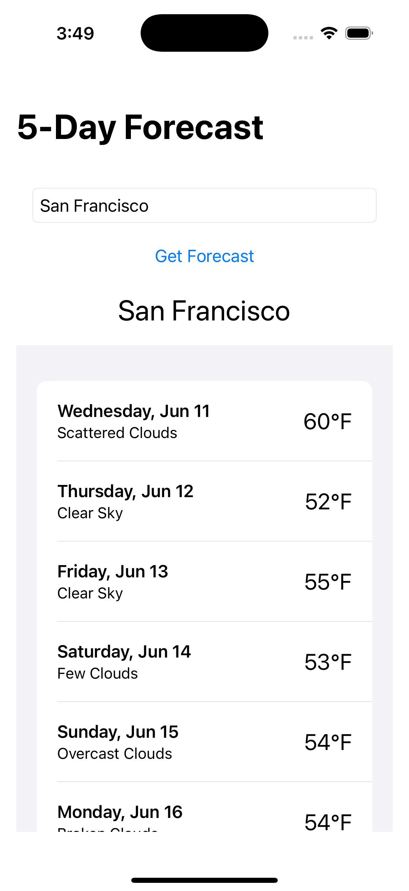

# IOS Weather App

This is a simple SwiftUI-based iOS weather app that fetches real-time weather forecast data using the [OpenWeather API](https://openweathermap.org/api). Users can enter a city name and view the current temperature, weather description, and an appropriate weather icon.

---

## Features

- 🔍 Search weather by city name
- 🌡 Display temperature in Fahrenheit
- ☁️ Show weather condition and dynamic icon (e.g., ☀️ for sunny, 🌧 for rainy)
- 🔁 Uses `URLSession` and `Codable` to fetch and parse API data
- 🧼 Clean SwiftUI interface

---

## Tech Stack

- Swift 5
- SwiftUI
- MVVM Architecture
- OpenWeather API
- Xcode 15+

---

## API Key Setup

This app uses the OpenWeather API.

---

## Getting Started

1. Clone the repository:
    ```bash
    git clone https://github.com/jabercrombia/ios-weather-app.git
    cd ios-weather-app
    ```

2. Open the `.xcodeproj` or `.xcworkspace` file in Xcode.

3. Set up your API key using the `.xcconfig` method above.

4. Build and run the app on a simulator or device.

---

## Sample Screenshot



---

## 📋 Todo

- [ ] Add 5-day forecast view
- [ ] Show sunrise/sunset times
- [ ] Add light/dark mode support
- [ ] Save recent cities

---

## License

This project is licensed under the MIT License.

---

## Acknowledgements

- [OpenWeather API](https://openweathermap.org/)
- Apple SwiftUI Documentation
